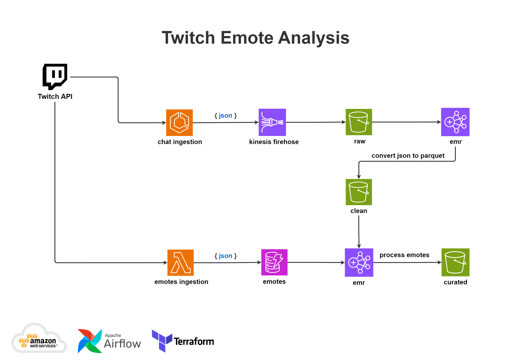

# Twitch Emote Analysis

DataLake para armazenar mensagens do chat da Twitch.tv para que seja possível fazer análises próximas ao tempo real dos emotes mais utilizados por usuários do chat.

## Status

WORK IN PROGRESS

## Arquitetura de Dados

## Ferramentas

- Python
- PySpark
- Git/Github
- Pyenv/Poetry
- Docker
- Terraform
- Bash
- Airflow

## Serviços AWS

- ECS
- Kinesis
- Lambda
- EC2
- RDS
- DynamoDB
- S3
- EMR
- VPC
- Cloud Watch
- Secrets Manager
