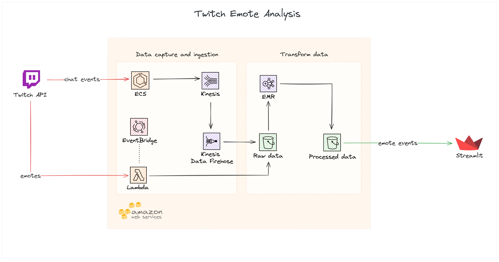

# Twitch Emote Analysis

Projeto de engenharia de dados para análise de emotes mais utilizados nos chats dos canais da Twitch TV.

## Motivação

Este é um projeto de estudos e prova de conteito. O Objetivo é criar um pipeline de dados para análise de dados Near Real-Time.

## Status

WORK IN PROGRESS

## Pipeline de Dados

## Ferramentas

- Python
- PySpark
- Git/Github
- Pyenv/Poetry
- Docker
- Terraform
- Bash

## Serviços AWS

- ECS
- Kinesis
- Lambda
- EventBridge
- S3
- EMR
- VPC
- Cloud Watch
- Secrets Manager
